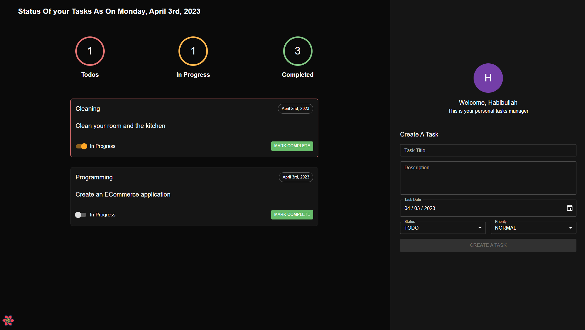

## Task Management UI

[Task Management API Repository](https://github.com/habibullahturkmen/task-management-api)

### Setup
#### First of all go to the [api](https://github.com/habibullahturkmen/task-management-api) and complete the setup there.
#### Copy ``.env.example`` to ``.env``
#### Change ``VITE_API_URL`` to your backend url in .env file.
#### Install node.js and yarn in your computer

### Run ``yarn`` to install dependencies
```bash
yarn
```

### Run ``yarn dev`` to start a development server
```bash
yarn dev
```

### Or run ``yarn build && yarn start`` to start a production server

```bash
yarn build && yarn preview
```

### Preview

